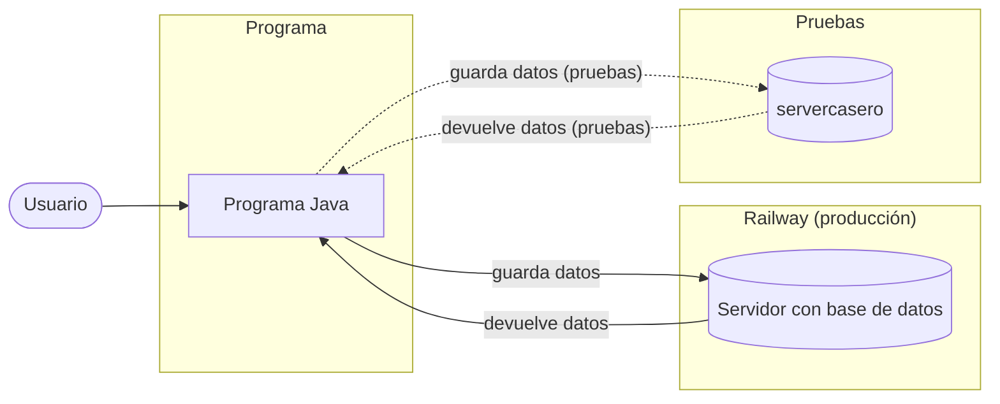
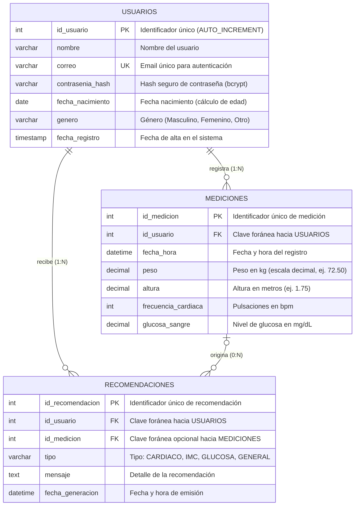

# Diagrama de infraestructura

# Modelo Relacional

El modelo relacional está diseñado en **Tercera Forma Normal (3NF)** para garantizar la integridad referencial, eliminar redundancias y escalar eficientemente en **MySQL**.

### Diagrama Entidad-Relación

---

### Especificación de Tablas y Esquema Relacional

#### 1. Notación Relacional Formal
* **`USUARIOS`** (**`id_usuario`** [PK], `nombre`, `correo` [UK], `contrasenia_hash`, `fecha_nacimiento`, `genero`, `fecha_registro`)
* **`MEDICIONES`** (**`id_medicion`** [PK], `id_usuario` [FK], `fecha_hora`, `peso`, `altura`, `frecuencia_cardiaca`, `glucosa_sangre`)
* **`RECOMENDACIONES`** (**`id_recomendacion`** [PK], `id_usuario` [FK], `id_medicion` [FK], `tipo`, `mensaje`, `fecha_generacion`)

#### 2. Relaciones e Integridad Referencial
1. **USUARIOS — MEDICIONES (1 : N)**
   * Un usuario puede registrar $0$ a muchas mediciones a lo largo del tiempo.
   * Cada medición pertenece estrictamente a un único usuario (`id_usuario NOT NULL`).
   * Clave Foránea: `MEDICIONES.id_usuario` $\rightarrow$ `USUARIOS.id_usuario` (`ON DELETE CASCADE`, `ON UPDATE CASCADE`).

2. **USUARIOS — RECOMENDACIONES (1 : N)**
   * Un usuario recibe múltiples recomendaciones generadas por el sistema.
   * Clave Foránea: `RECOMENDACIONES.id_usuario` $\rightarrow$ `USUARIOS.id_usuario` (`ON DELETE CASCADE`, `ON UPDATE CASCADE`).

3. **MEDICIONES — RECOMENDACIONES (0 : N)**
   * Una medición específica puede disparar o asociarse a una recomendación (relación opcional).
   * Clave Foránea: `RECOMENDACIONES.id_medicion` $\rightarrow$ `MEDICIONES.id_medicion` (`ON DELETE SET NULL`, `ON UPDATE CASCADE`).

#### 3. Criterios de Diseño y Buenas Prácticas Técnicas
* **Seguridad de Credenciales**: No se almacena la contraseña en texto plano; se define `contrasenia_hash` con capacidad para almacenar hashes seguros (e.g., BCrypt/Argon2).
* **Campos Atómicos y Flexibilidad Biométrica**: Los campos biométricos (`peso`, `altura`, `frecuencia_cardiaca`, `glucosa_sangre`) son opcionales (`NULLABLE`), respetando el requerimiento donde el usuario no necesita cargar todos los valores en cada toma.
* **Regla de Negocio / Restricción**: Se añade una restricción de validación (`CHECK`) para asegurar que al menos un dato biométrico sea provisto al insertar una medición.
* **Cálculo Derivado**: La edad no se almacena para evitar inconsistencias cronológicas; se calcula en tiempo de ejecución o consulta a partir de `fecha_nacimiento`.

