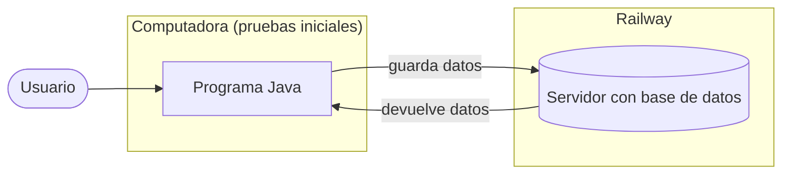

# Diagrama de infraestructura

```mermaid
flowchart LR
    Usuario(["Usuario"])

    subgraph PC["Computadora (pruebas iniciales)"]
        Programa["Programa Java"]
    end

    subgraph Railway["Railway"]
        Servidor[("Servidor con base de datos")]
    end

    Usuario --> Programa
    Programa -->|"guarda datos"| Servidor
    Servidor -->|"devuelve datos"| Programa
```

# Modelo Relacional
