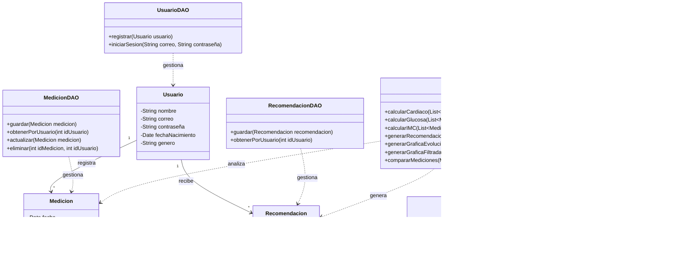

# Diagrama de clases

---

## Casos de Uso

### Actores

* **Usuario:** utiliza la aplicación para registrar, consultar y analizar sus datos biométricos.

### CU01 - Registrarse

**Actor:** Usuario

**Objetivo:** Crear una cuenta en el sistema.
#### Flujo principal
1. El usuario selecciona la opción de registrarse.
2. El sistema solicita los datos necesarios.
3. El usuario introduce sus datos.
4. El sistema valida la información.
5. El sistema crea la cuenta.
6. El sistema confirma el registro.

#### Flujo alternativo

* Si los datos introducidos no son válidos, el sistema informa al usuario y solicita corregirlos.

### CU02 - Iniciar sesión

**Actor:** Usuario

**Objetivo:** Acceder a su cuenta.

#### Flujo principal

1. El usuario introduce sus credenciales.
2. El sistema verifica los datos.
3. El sistema permite el acceso a la cuenta.

#### Flujo alternativo

* Si las credenciales son incorrectas, el sistema informa al usuario y solicita introducirlas nuevamente.

### CU03 - Registrar datos biométricos

**Actor:** Usuario

**Objetivo:** Guardar nuevas mediciones biométricas.

##### Flujo principal

1. El usuario selecciona la opción para registrar una medición.
2. El sistema solicita los datos disponibles.
3. El usuario introduce sus mediciones.
4. El sistema valida los datos.
5. El sistema guarda las mediciones junto con la fecha.
6. El sistema confirma el registro.

##### Datos que se pueden registrar

* Peso.
* Altura.
* Edad.
* Frecuencia cardíaca.
* Otros datos definidos por el proyecto.

### CU04 - Actualizar datos biométricos

**Actor:** Usuario

**Objetivo:** Modificar una medición registrada anteriormente.

#### Flujo principal

1. El usuario selecciona un registro anterior.
2. El sistema muestra los datos registrados.
3. El usuario modifica la información.
4. El sistema valida los nuevos datos.
5. El sistema guarda los cambios.
6. El sistema confirma la actualización.

#### Flujo alternativo

* Si los nuevos datos no son válidos, el sistema informa al usuario y solicita corregirlos.

### CU05 - Consultar historial

**Actor:** Usuario

**Objetivo:** Consultar las mediciones realizadas anteriormente.

#### Flujo principal

1. El usuario selecciona la opción de historial.
2. El sistema obtiene los registros del usuario.
3. El sistema muestra las mediciones ordenadas por fecha.
4. El usuario puede consultar los diferentes registros.

### CU06 - Calcular promedios

**Actor:** Usuario

**Objetivo:** Obtener el promedio de sus mediciones.

#### Flujo principal

1. El usuario selecciona el tipo de medición que desea analizar.
2. El sistema obtiene los registros correspondientes.
3. El sistema calcula el promedio.
4. El sistema muestra el resultado.

### CU07 - Visualizar gráficos

**Actor:** Usuario

**Objetivo:** Observar visualmente la evolución de sus mediciones.

#### Flujo principal

1. El usuario selecciona el tipo de dato que desea consultar.
2. El sistema obtiene los registros históricos.
3. El sistema genera un gráfico con los datos.
4. El sistema muestra el gráfico al usuario.

### CU08 - Comparar mediciones

**Actor:** Usuario

**Objetivo:** Comparar mediciones realizadas en diferentes fechas.

#### Flujo principal

1. El usuario selecciona el tipo de medición que desea comparar.
2. El usuario selecciona las fechas que desea comparar.
3. El sistema obtiene los datos correspondientes.
4. El sistema muestra las diferencias entre las mediciones.

### CU09 - Obtener recomendaciones

**Actor:** Usuario

**Objetivo:** Recibir recomendaciones generales basadas en los datos registrados.

#### Flujo principal

1. El usuario solicita recomendaciones.
2. El sistema analiza los datos registrados.
3. El sistema genera recomendaciones generales.
4. El sistema muestra las recomendaciones al usuario.

#### Consideración

Las recomendaciones proporcionadas por el sistema son de carácter general y no sustituyen una evaluación o recomendación profesional.

### CU10 - Visualizar progreso

**Actor:** Usuario

**Objetivo:** Obtener un resumen de la evolución de sus datos.

#### Flujo principal

1. El usuario accede a la sección de progreso.
2. El sistema obtiene los registros del usuario.
3. El sistema analiza la evolución de los datos.
4. El sistema genera un resumen.
5. El sistema muestra estadísticas y gráficos relacionados con el progreso.
