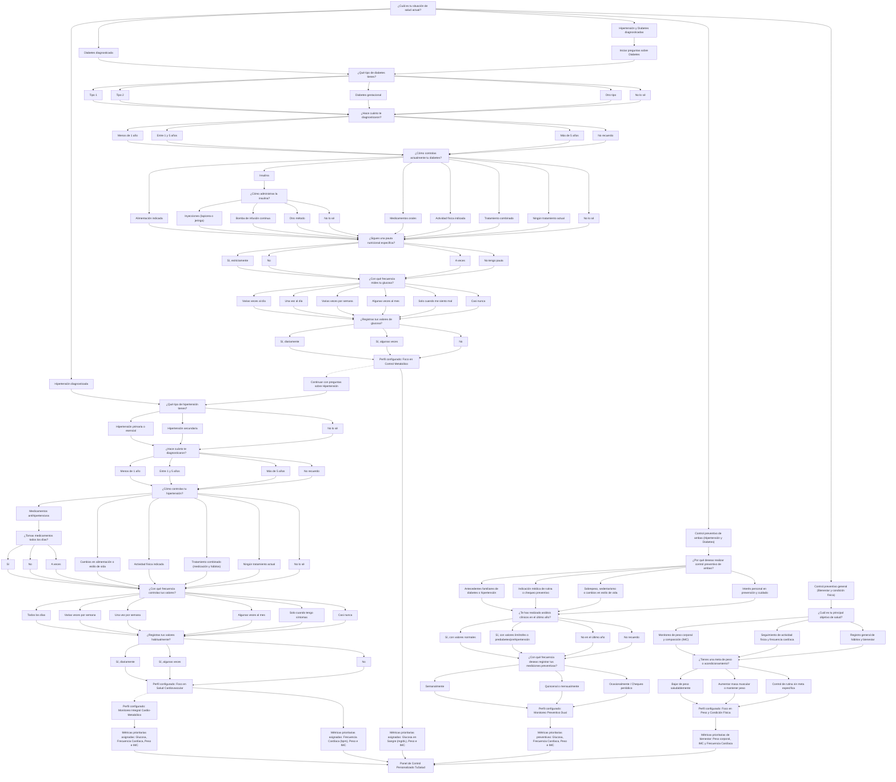

# Proyecto: TuSalud
Hecho por Manuel Pintaluba, Sofía Cedrés, Rodrigo Alonso y Fabian Guillermo.

### Descripción del problema y solución:

El problema que busca resolver TuSalud es la dificultad para registrar, organizar y analizar longitudinalmente datos biométricos personales de forma centralizada. Las personas que desean realizar un seguimiento de sus datos biométricos pueden registrar sus mediciones en diferentes lugares, como anotaciones manuales, planillas de cálculo o aplicaciones que no están específicamente adaptadas a sus necesidades.

Esto dificulta consultar el historial de mediciones, comparar registros realizados en diferentes fechas y visualizar la evolución de los datos de forma organizada.

Nuestro objetivo es desarrollar una aplicación que permita a los usuarios registrar y realizar un seguimiento de sus datos biométricos a lo largo del tiempo.

La aplicación permitirá ingresar diferentes datos personales y físicos, almacenarlos y analizarlos para obtener promedios, estadísticas y gráficos que faciliten la visualización del progreso. De esta manera, el usuario podrá comparar sus mediciones actuales con registros anteriores y observar su evolución de forma clara y sencilla.

Además, el sistema podrá proporcionar recomendaciones generales basadas en los datos registrados, con el objetivo de ayudar al usuario a comprender mejor su progreso y establecer metas personales.

En resumen, buscamos crear una herramienta simple, visual e intuitiva que permita registrar datos, analizar cambios y llevar un control organizado de la evolución del usuario.

## Alcance

El proyecto contempla:

- Registro e inicio de sesión de usuarios.
- Cuestionario de bienvenida (onboarding) para personalizar el perfil y definir variables clave de seguimiento.
- Registro de mediciones biométricas.
- Consulta y modificación del historial.
- Cálculo de estadísticas.
- Visualización mediante gráficos.
- Comparación entre mediciones.
- Generación de recomendaciones generales.

El proyecto no pretende realizar diagnósticos médicos ni sustituir la evaluación de profesionales de la salud.

## Cuestionario Médico Inicial (Flujo de Onboarding)

Para conocer las necesidades particulares de cada usuario y determinar automáticamente qué variables biométricas priorizar en su seguimiento, el sistema contempla el siguiente flujo condicional interactivo:

### Configuración resultante del perfil y restricción de variables biométricas:

El sistema garantiza que **cada usuario únicamente pueda registrar y modificar las variables biométricas que influyen en las opciones que seleccionó en su Cuestionario Médico Inicial**, bloqueando automáticamente los campos no pertinentes tanto al ingresar nuevas mediciones como al editarlas en el historial:

* **Diabetes diagnosticada:** Solo permite registrar y modificar **Glucosa en sangre (mg/dL)** y control metabólico de **Peso corporal e IMC**. Si el usuario selecciona monitoreo exclusivo de glucemia, los campos de peso y altura también se bloquean. La **Frecuencia Cardíaca (bpm) queda deshabilitada** por no influir en el control directo de la diabetes.
* **Hipertensión diagnosticada:** Solo permite registrar y modificar **Frecuencia Cardíaca (bpm)** y control de sobrepeso (**Peso corporal e IMC**). La **Glucosa en sangre queda deshabilitada** por no influir en la salud cardiovascular primaria.
* **Hipertensión y Diabetes / Preventivo Dual:** Permite el registro integral de las cuatro variables biométricas para un seguimiento clínico cruzado cardio-metabólico.
* **Control preventivo general:** Permite peso, altura y pulsaciones según el objetivo físico elegido (descenso de peso, rendimiento deportivo o salud general), bloqueando la glucosa al tratarse de un usuario sin afección metabólica.

---

## Alternativas consideradas

Una alternativa considerada fue utilizar una planilla de cálculo para que cada usuario registrara manualmente sus mediciones.

Esta alternativa permite almacenar datos y realizar cálculos básicos, pero requiere que el usuario organice manualmente la información y no proporciona una aplicación integrada con autenticación, historial, gráficos, comparaciones y recomendaciones.

Por este motivo se eligió desarrollar una aplicación propia que centralice estas funcionalidades.

# Marco teórico
### Datos biométricos registrados

La aplicación permitirá registrar los siguientes datos biométricos:

* **Peso:** peso corporal del usuario.
* **Altura:** altura del usuario.
* **Frecuencia cardíaca:** cantidad de latidos por minuto.
* **Glucosa en sangre:** nivel de glucosa registrado en sangre.

Estos serán los únicos datos biométricos contemplados en la primera versión del sistema. No se incluirán otros tipos de mediciones hasta que sean definidos explícitamente en los requisitos del proyecto.

Cada registro podrá contener los datos disponibles en el momento de la medición. No será obligatorio que el usuario proporcione todos los datos en cada registro, siempre que se proporcione al menos un dato biométrico válido.

El sistema almacenará la fecha y hora en la que se realizó cada registro.

---
### Definición de una medición

Una instancia de `Medicion` representa un registro realizado por un usuario en una fecha y hora determinadas.

Una medición puede contener uno o varios datos biométricos disponibles en ese momento:

* Peso.
* Altura.
* Frecuencia cardíaca.
* Glucosa en sangre.

Los datos pertenecientes a una misma medición se consideran parte del mismo registro histórico.

Cada `Medicion` pertenece exclusivamente a un `Usuario` y no puede ser consultada ni modificada por otros usuarios.

La fecha y hora forman parte del registro para permitir ordenar el historial y comparar mediciones realizadas en diferentes momentos.

La edad no se almacenará como un dato independiente de `Medicion`. Se calculará a partir de la `fechaNacimiento` almacenada en `Usuario` cuando sea necesaria.

---
### Unidades de los datos biométricos

Todos los datos biométricos utilizarán las siguientes unidades:

| Dato                | Unidad                           |
| :------------------ | :------------------------------- |
| Peso                | kilogramos (kg)                  |
| Altura              | metros (m)                       |
| Frecuencia cardíaca | latidos por minuto (bpm)         |
| Glucosa en sangre   | miligramos por decilitro (mg/dL) |

El sistema utilizará estas unidades internamente y no permitirá registrar valores utilizando otras unidades.

La altura se almacenará en metros utilizando valores decimales. Por ejemplo, una altura de 1 metro y 75 centímetros se registrará como `1.75 m`.

El peso se almacenará en kilogramos utilizando valores decimales. Por ejemplo, un peso de 72 kilogramos y 500 gramos se registrará como `72.5 kg`.
